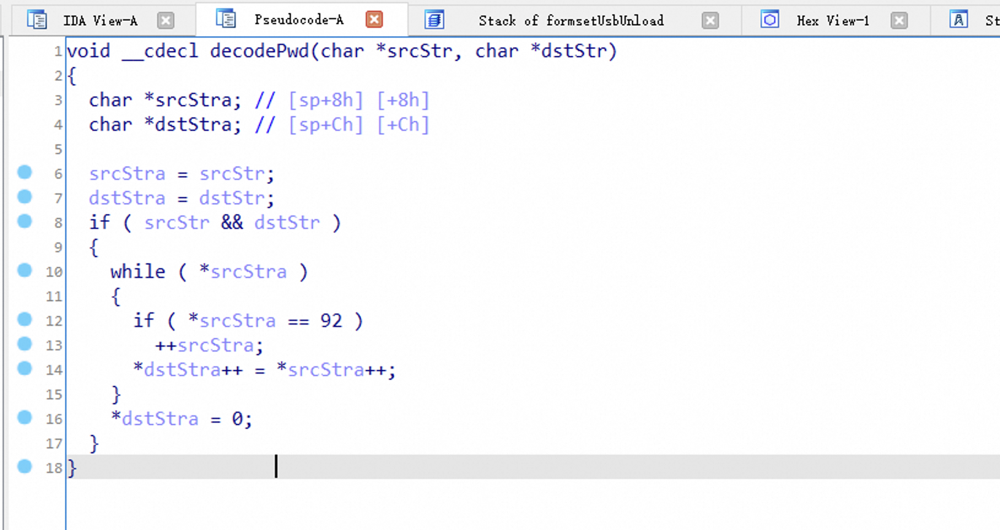

# Version

AC9V3.0升级软件 V15.03.06.42\_multi

# Firmware

https://www.tenda.com.cn/download/detail-2908.html

# Vulnerability Detail

The function "fromQuickIndex" contains a stack-based buffer overflow vulnerability. In the function, it reads in a user-provided parameter "PPPOEPassword", and the variable is passed to the function "decodePwd" without undergoing any length checks.

The purpose of the "decodePwd" function is to copy data from a source while filtering out "/" symbols. If the entered value of "PPPOEPassword" (referred to as "ppppwd") exceeds the size of the "decode\_pwd" array, it will result in a stack overflow.

# POC

Due to legal and policy reasons, we are unable to provide the exploit for this vulnerability at this time.

# CVE

CVE-2024-24543
