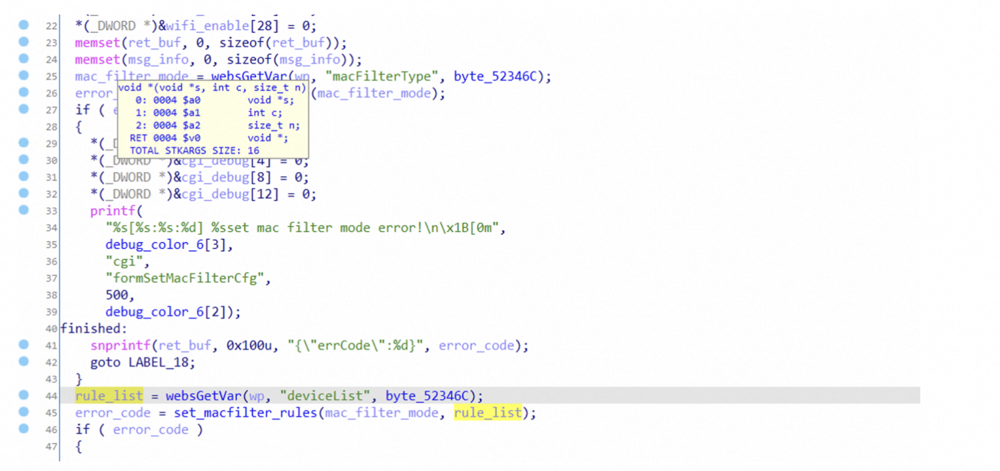
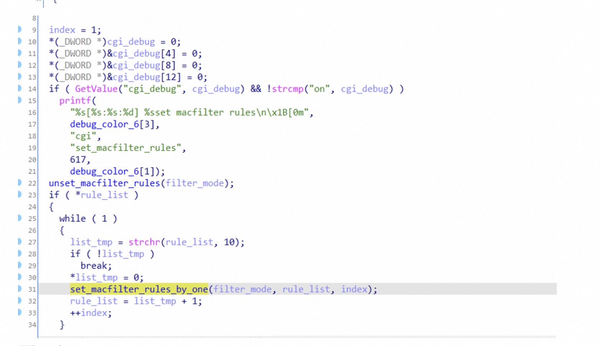

# Version

AC9V3.0升级软件 V15.03.06.42\_multi

# Firmware

https://www.tenda.com.cn/download/detail-2908.html

# Vulnerability Detail

TThe function "formSetMacFilterCfg" contains a stack-based buffer overflow vulnerability. In the function, it reads in a user-provided parameter "rule_list", and the variable is passed to the function without any length check, which may lead to overflow of the stack-based buffer. As a result, by requesting the page, an attacker can easily execute a denial of service attack or remote code execution with carefully crafted overflow data.

# POC

Due to legal and policy reasons, we are unable to provide the exploit for this vulnerability at this time.

# CVE

CVE-2024-25750
