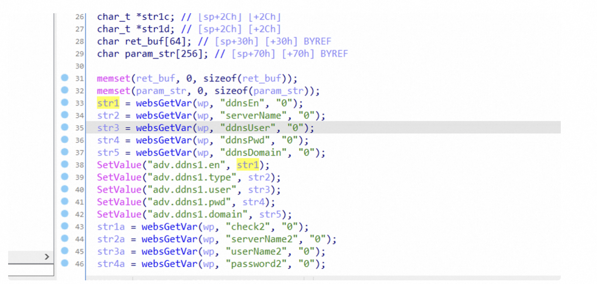
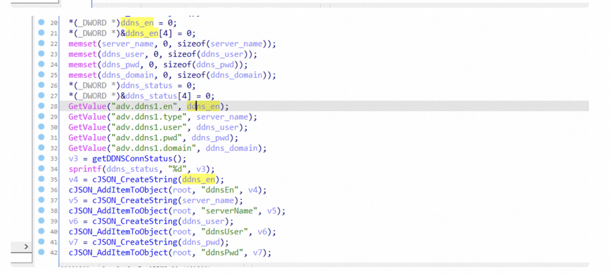

# Version

AC9V3.0升级软件 V15.03.06.42\_multi

# Firmware

https://www.tenda.com.cn/download/detail-2908.html

# Vulnerability Detail

The function "formGetSysToolDDNS" contains a stack-based buffer overflow vulnerability.

The function `formSetSysToolDDNS` can set nvram val `adv.ddns1.en` to` str1` , **which can be set through POST parameter`ddnsEn`**.

and in function `formGetSysToolDDNS` , the function calls `GetValue(“adv.ddns1.en”, ddns_en)` to set the string to` ddns_en` which is on the stack. So there is a stack overflow vulnerability. By analyze the funtion GetValue and SetValue , the max size of the string we can get from the function GetValue is bigger than the size of`ddns_en `, so there is a buffer overflow vulnerability.

# POC

Due to legal and policy reasons, we are unable to provide the exploit for this vulnerability at this time.

# CVE

CVE-2024-25747
